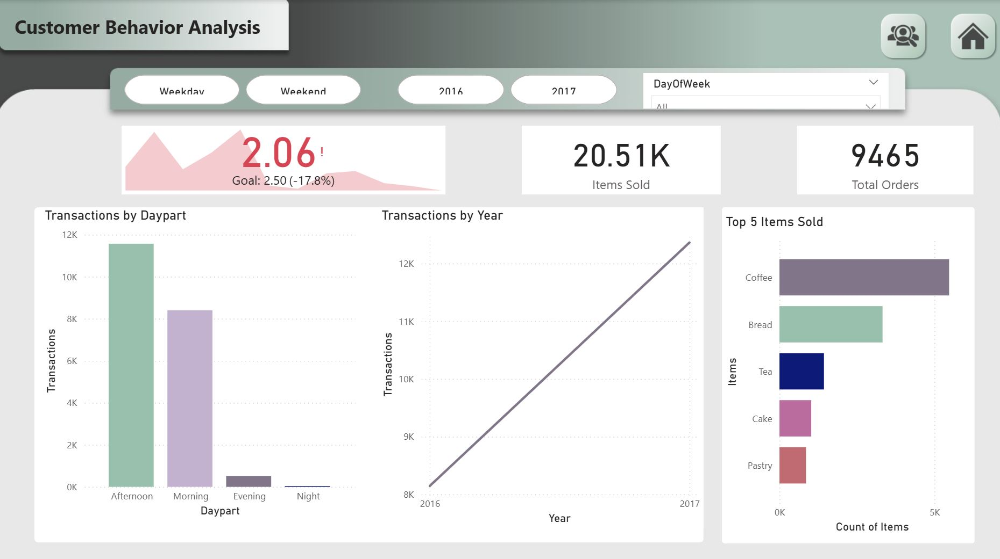
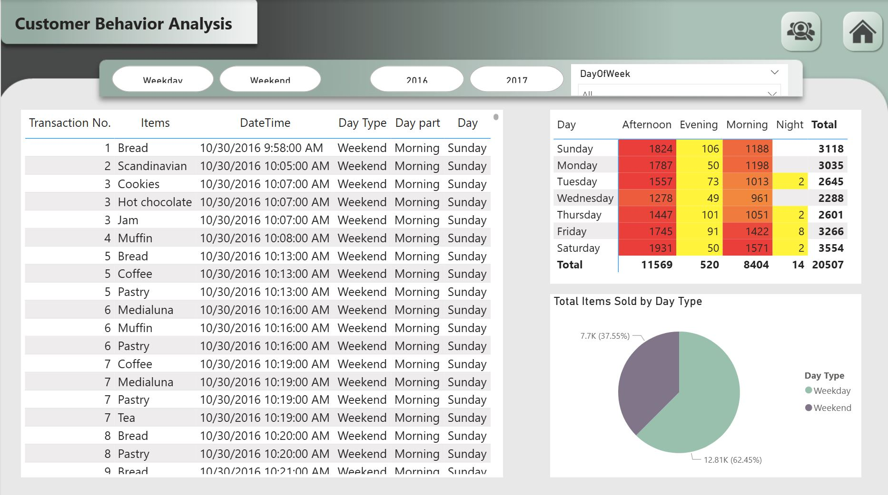

# Customer Behavior Analysis Dashboard 📈

This Power BI dashboard analyzes customer purchasing behavior to uncover patterns in sales by day, time, and item category. It provides a clear overview of total orders, items sold, and customer activity across different periods (weekday vs weekend). The visuals help identify when and what customers buy most frequently, supporting data-driven business decisions.

## 💡 Key Highlights
Comprehensive Overview Page: Summarizes total transactions, items sold, and top-selling products with comparisons by year and daypart.

Detailed Report Page: Breaks down individual transactions, day types, and sales distribution by day and time, helping to pinpoint high-activity periods.

Interactive Filters: Users can filter by weekday/weekend, year, or day of the week for deeper insights.

Data-Driven Insights: Shows that afternoons and weekends generate the highest sales, with coffee, bread, and tea as top items.

Visualization Tools: Combination of bar charts, line graphs, heatmaps, and pie charts for clear performance tracking.

## 🗂️ Dataset Source

The dataset for this dashboard was sourced from Kaggle.

## 🛠️ Tools Used
Power BI | Excel  

## 📸 Preview
 & 

---

### ⚠️ License & Usage Notice
This dashboard is shared for portfolio and educational purposes only.  
Unauthorized copying, reuse, or distribution of the content is prohibited.